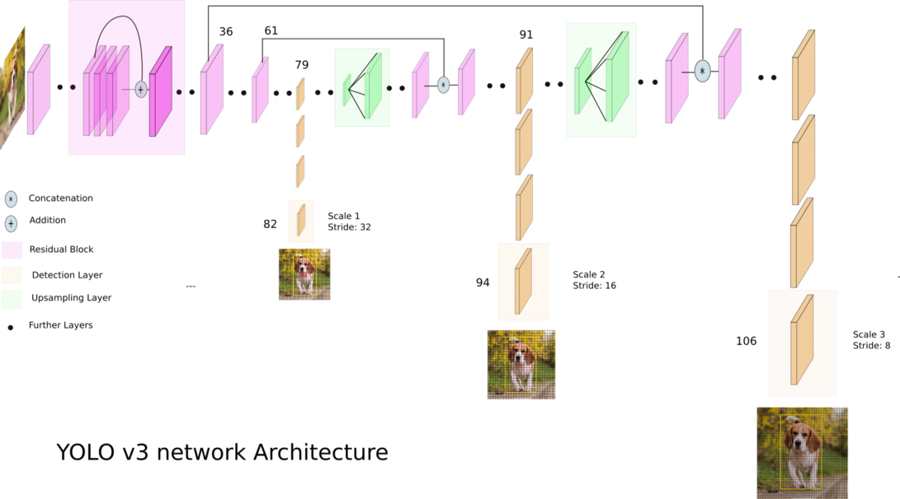

YOLO Face
#########

Deep learning-based Face detection using the YOLOv3 algorithm

Contents
********

-  `Getting Started <#getting-started>`__

-  `YOLOv3's Architecture <#yolov3-s-architecture>`__

-  `OpenCV Deep Neural Networks (dnn module) <#opencv-deep-neural-networks-dnn-module>`__

-  `Prerequisites <#prerequisites>`__

-  `Usage <#usage>`__

Getting Started
***************

The YOLOv3 (You Only Look Once) is a state-of-the-art, real-time object detection algorithm. The published model recognizes 80 different objects in images and videos. For more details, you can refer to this `paper <https://pjreddie.com/media/files/papers/YOLOv3.pdf>`_.

YOLOv3's Architecture
*********************

Credit: `Ayoosh Kathuria <https://towardsdatascience.com/yolo-v3-object-detection-53fb7d3bfe6b>`_

OpenCV Deep Neural Networks (dnn module)
****************************************

OpenCV ``dnn`` module supports running inference on pre-trained deep learning models from popular frameworks such as TensorFlow, Torch, Darknet and Caffe.

Prerequisites
*************

* TensorFlow==1.8
* opencv-python
* opencv-contrib-python
* Numpy
* Keras
* Matplotlib
* Pillow (PIL)

.. note:: Development for this project will be isolated in Python virtual environment. This allows us to experiment with different versions of dependencies.

There are many ways to install virtual environment (virtualenv), see the `Python Virtual Environments: A Primer <https://realpython.com/python-virtual-environments-a-primer/>`_ guide for different platforms, but here are a couple:

**For Ubuntu**

.. code:: bash

    $ pip install virtualenv

**For macOS**

.. code:: bash

    $ pip install --upgrade virtualenv

Create a Python 3.6 virtual environment for this project and activate the virtualenv:

.. code:: bash

    $ virtualenv -p python3.6 yoloface
    $ source ./yoloface/bin/activate

Next, install the dependencies for the this project:

.. code:: bash

    $ pip install -r requirements.txt

Usage
*****

1 .Clone this repository

.. code:: bash

    $ git clone https://github.com/sthanhng/yoloface

2. For face detection, you should download the pre-trained YOLOv3 weights file which trained on the `WIDER FACE: A Face Detection Benchmark <http://mmlab.ie.cuhk.edu.hk/projects/WIDERFace/index.html>`_ dataset from this link and place it in the ``model-weights/`` directory.

3. Run the following command:

.. code:: bash
    
    $ python yoloface.py --image samples/outside_000001.jpg --output-dir outputs/

.. code:: bash

    $ python yoloface.py --video samples/subway.mp4 --output-dir outputs/

.. code:: bash

    $ python yoloface.py --src 1 --output-dir outputs/
